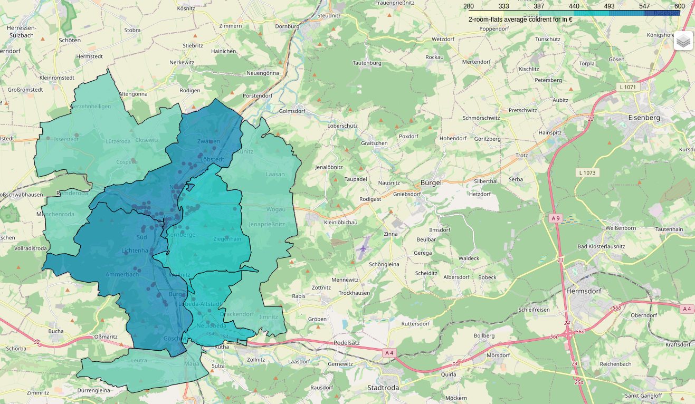

# real-estate-monitor
## Requirements

### Languages
- Python 3++
- MySQL 

### Modules
- Scrapy
- geopy
- MySQLdb
- hashlib
- folium
- geopandas

## Getting Started
In the currently version, use the realEstateSpider.py to start the scraping process. Just pass a town for the scraping process, to collect informations from aparments in jena or berlin. 

 ```
 python3 realEstateSpider.py <town>
 ```
 ## Software-Description
 ### realEstateSpider
 The real-estate-monitor is a software, developed with the scraping framework scrapy. It was developed as a part of a scientific work, to create an automated markt overview for real estates in any town or location. The information would be scraped from the real estate markets  
    - [wg-gesucht](https://www.wg-gesucht.de)\
    - [immobilienscout24](https://www.immobilienscout24.de)\
    - [immonet](https://www.immonet.de)

The scraped informations are checked for duplicates and the, the apartments are stored in a database. Before storing the data, for every apartment will be computed the coordinates. 
Every apartment object containts the following information, if they are available:
- domain
- date
- expose
- coldrent
- sidecosts
- surface
- roomnumber
- street
- postcode
- town
- latitude
- longitude
- hashvalue

This software containing links with search-results for the town. So, you can adjust the realEstateSpider.py for your needs. Also the to be collected informations.

For every town, you the this code to use the real-estate-monitor. Just pass for every spider the corresponding link with search results for apartments, and run the process.

```python
process.crawl(WggesuchtScraper, url="https://www.wg-gesucht.de/wohnungen-in-Jena.66.2.1.0.html?offer_filter=1&city_id=66&noDeact=1&categories%5B%5D=2&rent_types%5B%5D=0", town = tn)

process.crawl(ImmonetScraper, url="https://www.immonet.de/immobiliensuche/sel.do?&sortby=0&suchart=1&objecttype=1&marketingtype=2&parentcat=1&city=111924&locationname=Jena", town = tn)

process.crawl(Is24Scraper, url="https://www.immobilienscout24.de/Suche/de/thueringen/jena/wohnung-mieten", town = tn)
```

### choropleth
The choropleth.py is an additional software to evaluate the collected informations for a town and creating a choropleth map.



In this example picture, choropleth.py takes the value **2** and creating for every district the average coldrent for apartmants with a roomnumber of two. For creating a choropleth map, the coordinates are necessary.

Further, in the repository you can find datasets for berlin and jena with collected informatins, stored in a JSON-File.